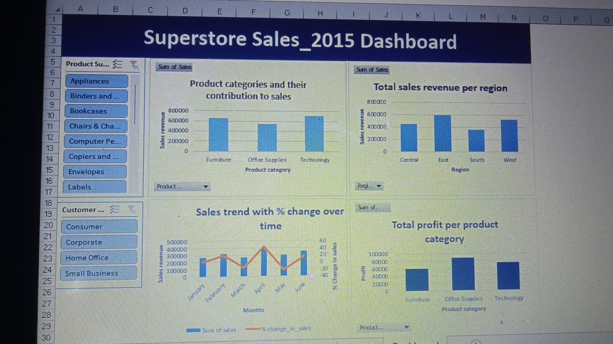

# Superstore Sales Analysis

### Project Overview

This project aims to analyze the sales data of a fictional retail company for the year 2015. The goal is to identify trends, gain insights into the sales performance and make recommendations,to help the company make informed decisions to drive business growth.

### Data sources

SuperStoreUS-2015(Orders): The primary dataset used for this analysis is the "SuperStoreUS-2015(Orders).xlsx" file, containing information on products, orders and customers.

### Tool

- Excel - for data cleaning, analysis and report creation [Download here](https://microsoft.com)

### Methodology

1. Data cleaning/preparation
2. Exploratory data analysis (EDA):
 It involved exploring the data to answer questions like:
   - What is the total revenue generated by the store?
   - Which category of products contributes the most to sales?
   - How has the sales trend been for the year?
   - Which region has the highest sales and which one has the lowest?
   - What is the average profit margin of the store?

### Results/Findings

The results of the data analysis are as follows:
1. The revenue generated by the store for the 6 months period of sales totals $1924337.88 (US Dollars).
2. Products that fall under Technology category made the highest contribution to sales, followed by furniture, then office supplies.
3. Sales fluctuated, it declined and increased with each passing month. It reached its peak in the month of April while the least sales was recorded in March.
4. Most orders came from customers in the Eastern region, followed by those in the western region, then central, with southern region being the least.
5. The average profit margin of the store is $114.79.

### Recommendations

Based on the analysis, the following actions are recommended:
1. Focus on increasing the Technology category`s product marketing and promotion since they generate more revenue.
2. Focus marketing efforts on the Eastern and Western region where most orders originate.
3. Investigate reasons behind sales peak in April and decline in March. Also implement strategies to reduce sales fluctuations, such as good customer service.

       
